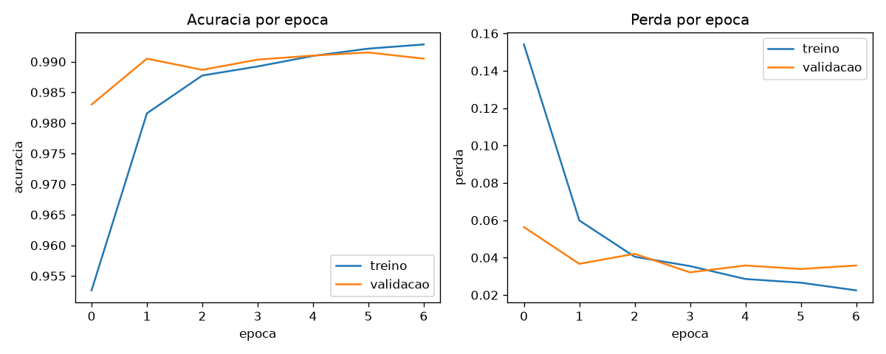
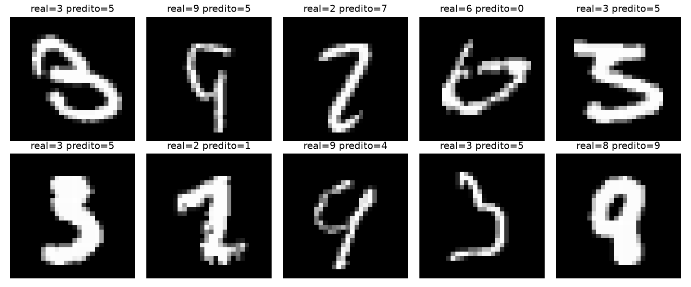

# Projeto 1 — Classificação MNIST

## 💻 O Desafio Técnico

Desenvolva um **modelo de Visão Computacional** capaz de **classificar dígitos manuscritos (0-9)**, e posteriormente **otimize-o para execução em dispositivos Edge**.

O foco não é apenas obter alta acurácia, mas **compreender o fluxo completo**:

**treinamento → validação → salvamento → conversão → otimização**

## 🎯 Conjunto de Dados

Dataset **MNIST**, disponível diretamente via `tf.keras.datasets.mnist` (não é necessário download manual).

## ✅ Requisitos Obrigatórios

### Etapa 1 — Treinamento do Modelo (`train_model.py`)

Implemente:

- Carregamento do dataset MNIST via TensorFlow
- **Split explícito treino/validação** (ex: `validation_split` ou um split manual)
- Construção de uma CNN com:
  - **3 a 4 blocos convolucionais** (`Conv2D` + `BatchNormalization` + `MaxPooling2D`)
  - Camada de `Dropout` antes da saída, para regularização
- Treinamento com **early stopping** baseado na perda de validação (`EarlyStopping`)
- Exibição da **acurácia de validação final** no terminal
- Salvamento do modelo treinado em formato Keras (`model.h5`)

### Etapa 2 — Otimização do Modelo (`optimize_model.py`)

Implemente:

- Carregamento do `model.h5` treinado
- Conversão para **TensorFlow Lite** (`model.tflite`)
- Aplicação de uma técnica de otimização (ex: **Dynamic Range Quantization**)

### Etapa 3 — Inferência com o Modelo Otimizado (`run_inference.py`)

Implemente:

- Carregamento especificamente do **`model.tflite`** (o artefato de edge — não
  o `model.h5`) usando `tf.lite.Interpreter`
- Execução de inferência em pelo menos **5 amostras** do conjunto de teste
- Exibição no terminal, para cada amostra, da classe **predita** vs. a classe **real**

> 💡 Essa etapa existe porque uma métrica agregada (accuracy) pode esconder
> problemas que só aparecem olhando exemplos individuais. Também é o teste mais
> próximo do uso real em produção: carregar o artefato de edge e classificar
> uma entrada por vez.

**Objetivo:** reduzir o tamanho do modelo, mantendo desempenho adequado para aplicações de Edge AI.

## 📂 Estrutura da Pasta

⚠️ Não altere os nomes dos arquivos.

```
projetos/1-classificacao-mnist/
├── train_model.py         # ✏️ Treinamento do modelo
├── optimize_model.py      # ✏️ Conversão e otimização
├── run_inference.py       # ✏️ Inferência de exemplo com o modelo otimizado
├── requirements.txt       # 📄 Dependências do projeto
├── model.h5               # 🤖 Gerado por você — deve ser commitado
├── model.tflite           # ⚡ Gerado por você — deve ser commitado
└── README.md               # 📝 Este arquivo (também usado como relatório)
```

## ⚠️ Restrições e Considerações de Engenharia

- Entrada do modelo: imagens 28x28, 1 canal (grayscale), normalizadas em [0, 1]
- CNN simples — evite arquiteturas muito profundas
- Não utilize modelos pré-treinados
- Número de épocas limitado (ex: até 15, com early stopping)
- Treinamento apenas em CPU

## ⚖️ Critérios de Avaliação

- **Funcionalidade** — execução correta dos scripts e geração dos arquivos `.h5` e `.tflite`
- **Qualidade do modelo** — acurácia de validação consistente com o esperado para o dataset
- **Edge AI** — conversão correta para `.tflite` com técnica de otimização aplicada
- **Documentação** — preenchimento adequado do relatório abaixo

---

## 📝 Relatório do Candidato

👤 **Nome Completo: Amanda Kellen Farias Lopes**

### 1️⃣ Resumo da Arquitetura do Modelo

Construí uma CNN com 3 blocos convolucionais. Cada bloco tem uma camada Conv2D (com 32, 64 e 128 filtros, em cada bloco respectivamente) com ativação ReLU, seguida de uma BatchNormalization (ajuda a deixar o treino mais estável) e um MaxPooling2D (reduz o tamanho da imagem, mantendo só a informação mais importante).
Depois dos blocos convolucionais, achato tudo com uma camada Flatten e passo por uma Dense de 128 neurônios. Antes da saída, uso um Dropout de 0.3, que desliga 30% dos neurônios aleatoriamente durante o treino pra evitar que o modelo decore demais os dados (overfitting). A camada final é uma Dense de 10 neurônios com softmax, uma para cada dígito (0 a 9).
Para treinar, separei 10% dos dados de treino pra validação (validation_split=0.1) e usei EarlyStopping monitorando a perda de validação (val_loss), com paciência de 3 épocas, ou seja, se o modelo parar de melhorar por 3 épocas seguidas, o treino para sozinho. Deixei o limite máximo em 15 épocas. Escolhi 3 blocos ao invés de 4 porque o MNIST é um problema relativamente simples (imagens pequenas, preto e branco); um quarto bloco reduziria demais a imagem antes do Flatten sem ganho real de acurácia. O Dropout de 0.3 foi uma escolha intermediária: valores mais altos (tipo 0.5) tendem a atrapalhar a convergência em datasets já fáceis como o MNIST, e valores muito baixos não ajudam contra overfitting. A paciência de 3 épocas no EarlyStopping evita parar cedo demais por uma flutuação pontual do treino, sem deixar rodar tempo demais à toa.

### 2️⃣ Bibliotecas Utilizadas

TensorFlow 2.15.0
Keras 2.15.0
NumPy 1.26.x

### 3️⃣ Técnica de Otimização do Modelo

Depois de treinar, converti o modelo do formato .h5 pra .tflite (TensorFlow Lite), formato mais leve pra rodar em dispositivos com pouca memória. A técnica usada foi a quantização de alcance dinâmico (tf.lite.Optimize.DEFAULT), que reduz a precisão dos pesos do modelo (de números de 32 bits pra 8 bits), deixando o arquivo bem menor sem perder muita qualidade.

### 4️⃣ Resultados Obtidos

Acurácia de validação final: 99.05%
Acurácia no teste: 99.13%
Tamanho do model.h5: 2913.79 KB
Tamanho do model.tflite: 247.73 KB
Redução de tamanho: 91.5%

Além da acurácia agregada, gerei a matriz de confusão completa no conjunto de teste:




A maior confusão do modelo foi entre os dígitos 3 e 5 (11 casos), seguida por 2 e 7 (8 casos), 9 e 4, 7 e 1 e 3 e 7 (6 casos cada). Isso faz sentido visualmente. Por exemplo, um "3" com o traço central mal definido pode se parecer com um "5". Fora esses pares, o modelo erra pouco nas demais classes.

### 5️⃣ Comentários Adicionais (Opcional)

A maior dificuldade foi um bug de compatibilidade: o requirements.txt original pedia tensorflow>=2.12, sem limite de versão. Isso instalava a versão 2.21.0 (que usa o Keras 3), e essa versão dava erro ao tentar carregar de volta o model.h5 (um erro no inicializador GlorotUniform, algo interno da própria biblioteca).
Resolvi fixando a versão em tensorflow==2.15.0 no requirements.txt. Depois de retreinar e reenviar, os arquivos foram gerados normalmente e o GitHub Actions passou.

### 6️⃣ Exemplo de Inferência

Resultado ao rodar o run_inference.py usando o modelo otimizado (model.tflite):

Amostra 1: predito=7 | real=7
Amostra 2: predito=2 | real=2
Amostra 3: predito=1 | real=1
Amostra 4: predito=0 | real=0
Amostra 5: predito=4 | real=4

O modelo acertou as 5 amostras testadas. Para encontrar um caso mais interessante, busquei entre as primeiras 200 amostras aquela com a menor margem de confiança. Encontrei a amostra 18: o modelo errou (real=3, predito=5), com 65% de confiança no 5 contra apenas 30% no 3 correto. Esse erro bate exatamente com a maior confusão encontrada na matriz de confusão (3↔5), confirmando que o modelo tem uma dificuldade real e consistente em diferenciar esses dois dígitos, provavelmente por semelhança visual quando o traço central do 3 é escrito de forma mais arredondada.
